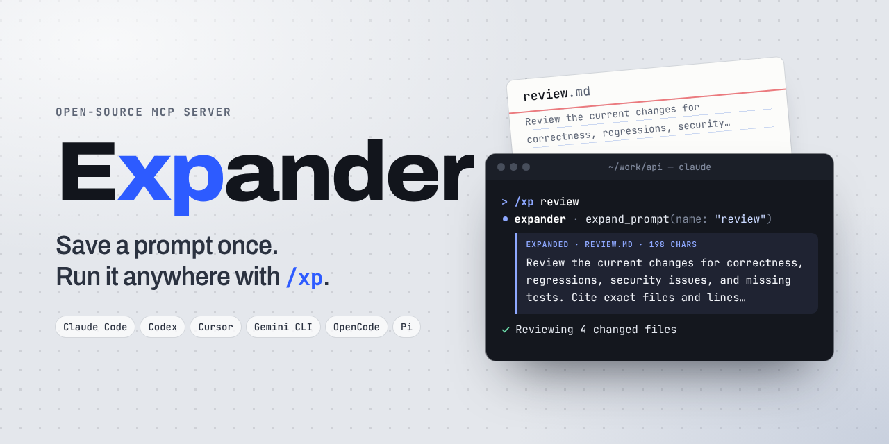

# Expander MCP



Save a long prompt once. Run it in any MCP-capable agent with a tiny command.

```text
/xp set review-prompt Review the current changes for correctness, regressions,
security issues, and missing tests. Cite exact files and lines.

/xp review-prompt
```

Expander stores prompts locally as Markdown, retrieves them through MCP, and tells the agent to follow the expanded prompt as the current instruction. It is a small native binary: no daemon, database, runtime, account, cloud sync, or telemetry.

## Install

Linux and macOS:

```sh
curl -fsSL https://raw.githubusercontent.com/JagritGumber/expander-mcp/main/install.sh | sh
```

Windows PowerShell:

```powershell
irm https://raw.githubusercontent.com/JagritGumber/expander-mcp/main/install.ps1 | iex
```

The installer downloads a checksum-verified native binary and runs `expander-mcp setup`. Setup detects supported harnesses, registers the MCP server through their native interface, installs the portable `xp` skill, and inspects the resulting registrations. Restart agent sessions that were already open.

You can rerun setup at any time:

```sh
expander-mcp setup
```

Target a particular harness, preview every action without writing, or consume structured results:

```sh
expander-mcp setup --client pi
expander-mcp setup --dry-run
expander-mcp setup --dry-run --json
```

Built-in adapters cover Codex, Claude Code, Pi, Gemini CLI, OpenCode, and Cursor. An explicitly requested missing or unverifiable client is an error instead of a silent skip. Other CLIs that follow the common `mcp add/list/remove` shape can be targeted by executable name:

```sh
expander-mcp setup --client my-agent
```

MCP standardizes how the agent and server communicate; each harness still owns its installation command. When a harness uses a different CLI shape, use its equivalent of `mcp add expander -- expander-mcp serve` or add the generic stdio configuration shown below.

## Install the `xp` skill into other harnesses

Expander is also a standard Agent Skill, so [skills.sh](https://skills.sh) can install the interaction layer into its supported coding agents:

```sh
npx skills add JagritGumber/expander-mcp --skill xp --global
```

This interactively detects and selects installed harnesses. MCP and Agent Skills solve different layers: the skill teaches the agent what `xp` means, while the MCP registration provides the four local tools.

## Use

| Intent | Skill-aware harness | Codex |
|---|---|---|
| Save | `/xp set review-prompt <prompt>` | `$xp set review-prompt <prompt>` |
| Run | `/xp review-prompt` | `$xp review-prompt` |
| Show blanks | `/xp show review-prompt` | `$xp show review-prompt` |
| Edit | `/xp edit review-prompt <change>` | `$xp edit review-prompt <change>` |
| List | `/xp list` | `$xp list` |
| Delete | `/xp delete review-prompt` | `$xp delete review-prompt` |

Invocation syntax is owned by each harness, not MCP. Codex uses the modern `$xp` skill syntax and retains `/prompts:xp` as a compatibility adapter; Claude Code exposes the skill as `/xp`.

### Arguments and templates

Saved prompts can use these placeholders:

- `$ARGUMENTS` or `{{args}}` — all invocation arguments
- `$1` through `$9` — whitespace-separated positional arguments
- `{{NAME}}` — a required blank, filled by a `NAME=value` argument
- `{{NAME?}}` — an optional blank
- `{{NAME=default}}` — a blank with a default, used everywhere `NAME` appears

Blank names are UPPER_SNAKE_CASE. Add `: hint` to any blank to say what belongs there. Defaults are literal text and cannot contain `:`, and `NAME=value` values cannot contain spaces. Other double-brace text, such as `{{ title }}`, `{{color: "red"}}`, or a lowercase `{{name}}`, is left as written, so code and template examples in your prompts are safe.

```text
/xp set focused-review Review {{FILE: the file or diff to review}} with emphasis on {{FOCUS=security}}. {{NOTES?}}
/xp focused-review FILE=src/auth.rs FOCUS=performance
/xp focused-review
```

You can leave blanks empty. `expand_prompt` lists them under `unresolved` and keeps them in the text as written. The agent fills each required blank from the conversation, such as the file you just edited or the current diff. It says which value it used in one line, then carries on. It asks only when the context doesn't make the value clear. It fills optional blanks only when the answer is obvious.

`/xp show <name>` prints a prompt's template, its blanks, and the positional forms it accepts. `/xp edit <name> <change>` rewrites a saved prompt in place, keeping the blanks the change doesn't mention. An edit is refused if the prompt changed after the agent read it, and every save keeps the text it replaced as `.<name>.md.bak` in the prompt directory.

## Terminal CLI

The same library is available without an agent:

```sh
expander-mcp set review-prompt "Review this change carefully."
expander-mcp list
expander-mcp get review-prompt
expander-mcp show review-prompt
expander-mcp delete review-prompt
expander-mcp path
```

Pipe multiline prompts into `set`:

```sh
expander-mcp set review-prompt < review-prompt.md
```

Prompts live in `$XDG_DATA_HOME/expander-mcp/prompts` or `~/.local/share/expander-mcp/prompts`. Set `EXPANDER_MCP_DIR` to use another directory or a synced folder.

## MCP tools

- `set_prompt(name, prompt, expected_version?)` — the save fails if `expected_version` no longer matches
- `expand_prompt(name, arguments?)` — returns the expanded `prompt` and any `unresolved` blanks
- `get_prompt(name)` — returns the raw template, its `placeholders`, its `positional` forms, and its `version`
- `list_prompts()`
- `delete_prompt(name)`

The server also implements MCP `prompts/list` and `prompts/get`, so clients with native prompt browsing can discover saved prompts directly. Each named blank appears as its own prompt argument, after the positional `arguments` entry when the prompt uses `$1`-style forms. None is marked required, so a field you leave empty is passed to the agent to fill in, and a value written as `NAME=value` goes to that blank whichever field it is in.

### Manual client configuration

```sh
codex mcp add expander -- expander-mcp serve
claude mcp add --scope user expander -- expander-mcp serve
pi mcp add expander -- expander-mcp serve
gemini mcp add --scope user expander expander-mcp serve
opencode mcp add expander --global -- expander-mcp serve
```

Generic stdio configuration:

```json
{
  "mcpServers": {
    "expander": {
      "command": "expander-mcp",
      "args": ["serve"]
    }
  }
}
```

## Build

```sh
cargo build --release
cargo test
```

Requires Rust 1.85 or newer. The server uses newline-delimited JSON-RPC over stdio and has only `serde` and `serde_json` as dependencies.

## Privacy and safety

- Prompts never leave your computer through Expander.
- Expander does not execute prompt text; the connected agent decides how to act on it under that agent's normal permissions.
- Prompt names are restricted to safe filename characters.
- Deletion is a separate MCP tool and the installed adapters require explicit intent.

## License

MIT
